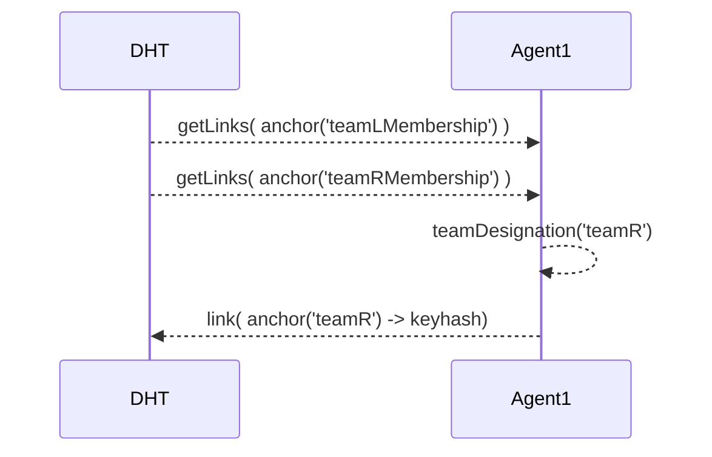
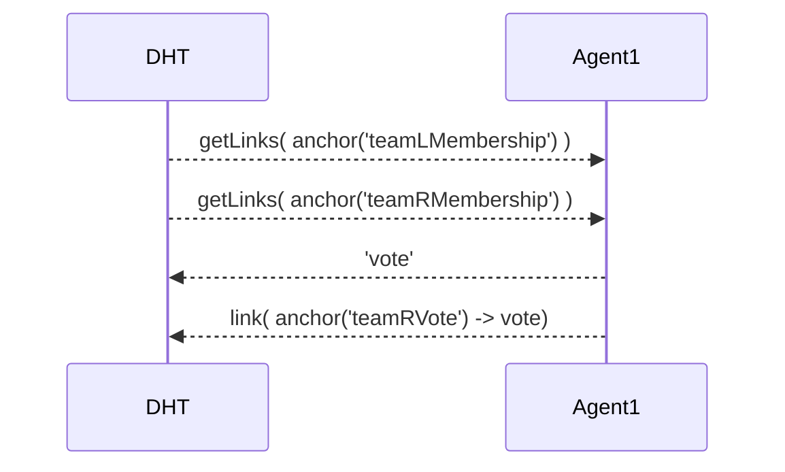
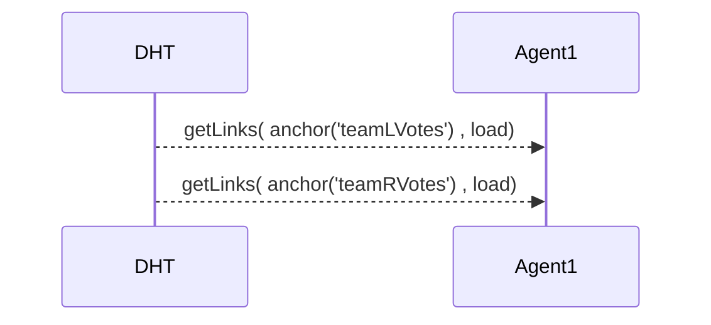

# PANOPTIPONG - CRDT Pong

## Installation

Run two processes:

```
# run holochain local dev server
hcdev web

# run react dev server
cd ui-src && npm start
```

Then go to http://localhost:3000

## Running tests

This repo uses an experimental method of running Holochain unit tests. It uses a fork of holochain-proto which adds a new command: `hcdev run-js`. This allows arbitrary execution of code in the Javascript ribosome, allowing us to use an existing JS test runner ([tape](https://github.com/substack/tape) in our case) to test app functionality.

Get the fork from https://github.com/maackle/holochain-proto. 
Then, `npm test -- [ZOME_NAME] [TEST_FILENAME]`.

e.g.: `npm test -- voting puretest/index.js`

### Setup

```
git clone github.com/maackle/holochain-proto
cd $GOPATH/github.com/maackle/holochain-proto && make
```

## Registration
- As an agent, when I join I link my key hash to a team membership anchor
- This is selected by picking the membership anchor with the fewest links
- An agent should not be able to register more than once



## Cast a vote
- As an agent on a team the game play UI should appear
- Retrieve the number of players in each team
- Commit an entry containing player counts, vote, agentHash, and salt
- Link to my team's vote anchor



## Get the state
- At any time the UI can query to get the state
- This retrieves the count of votes cast by each team
- If count is greater than X, sum the votes cast by each team
- How do we determine what turn it is?
- Reduce in to state and return this as an object
    - Calculate ball state as a continuous value by calculating the sum of votes weighted by the reciprocal of the number of players when the vote was cast
    - Calculate each paddle state as the sum of move weighted by the reciprocal of the number of players in that team


### state object
```
initialState = {
    ball: {
        x: 60,
        y: 50
    },
    paddleL: 50,
    paddleR: 50
}
```

### game constants

```
var vBall = 2.3; // how far the ball will move in a  'turn'
var vPaddle = 1.3; // how far the paddle can possible move in a 'turn'
var initialBallVelocity =  {x: vBall*Math.sqrt(2), y: vBall*Math.sqrt(2)}

var width=300, height=100;
var paddleHeight = 30;
```

### reducing votes in to state
```javascript
function reduceState(initialState, votesL, votesR) {

    var paddleL =  votesL.reduce(function(acc, elem) {
        acc += vPaddle * (elem.move / elem.teamL.playerCount);
    }, initialState.paddleL);

    var paddleR = votesR.reduce(function(acc, elem){
        acc += vPaddle * (elem.move / elem.teamR.playerCount);
    }, initialState.paddleR);

    var ballReducer = function(acc, elem, i) {
        acc.x += initialBallVelocity.x / (elem.teamL.playerCount + elem.teamR.playerCount);
        acc.y += initialBallVelocity.y / (elem.teamL.playerCount + elem.teamR.playerCount);
    }

    ballPos = votesR.reduce(ballReducer,
        votesL.reduce(ballReducer, initialState.ball));

    return {
        ball: ballPos,
        paddleL: paddleL,
        paddleR: paddleR
    }
}
```

# Public Methods

```javascript
/**
 * Register your agent to a team so you can vote
 */
function register() {
  // get the number of agents in each team so far
  var membersL = getLinks(anchor('members', 'L'), '');
  var membersR = getLinks(anchor('members', 'R'), '');

  // check the agent is not in any team already
  var inL = membersL.some(function(elem) {
    return elem.Hash ===  App.Key.Hash;
  });
  var inR = membersR.some(function(elem) {
    return elem.Hash ===  App.Key.Hash;
  });

  if( inL || inR ) {
    return "AlreadyRegistered";
  }

  var team;
  if(membersL.length <= membersR.length) {
    team = 'L';
  } else {
    team = 'R';
  }
  joinTeam(team);
  return team;
}
```

```javascript
/**
 * Cast a vote
 * @param       {integer}  vote   An integer in [-1,0,+1] representing how you want to move the paddle
 */
function vote(payload) {
  var move = payload.move;

  var nPlayersL = getLinks(anchor('members', 'L'), '').length;
  var nPlayersR = getLinks(anchor('members', 'R'), '').length;

  var nVotesL =countVotes("L");
  var nVotesR =countVotes("R");

  var vote = {
    move: move,
    teamL: {playerCount: nPlayersL, voteCount: nVotesL},
    teamR: {playerCount: nPlayersR, voteCount: nVotesR},
    agentHash: App.Key.Hash,
    randomSalt: ""+Math.random(),
    teamID: getTeam()
  };

  return castVote(vote);
}

function castVote(vote){
  if(anchorExists(vote.teamID,"GameID")==="false"){
    anchor(vote.teamID,"GameID");
  }

  voteHash = commit("vote",vote);
  // On the DHT, puts a link on my anchor to the new post
  commit('voteLink', {
    Links: [{ Base: anchor(vote.teamID,"GameID"), Link: voteHash, Tag: 'vote' }]
  });

  return voteHash;
}
```

### getState()
returns the state based on all votes seen so far
```javascript
/**
 * Retrieve the state as an object
 * @returns {object} an object that fully defines the game state to show
 * {ball: {x, y}, paddleL: pos, paddleR: pos}
*/
function reduceState(initialState, votesL, votesR) {

    var paddleL =  votesL.reduce(function(acc, elem) {
      if(elem.move!=-2){
        debug("paddleL move-> "+elem.move);
        acc += vPaddle * (elem.move / elem.teamL.playerCount);
      }
      return acc;
    }, initialState.paddleL);

    var paddleR = votesR.reduce(function(acc, elem){
      if(elem.move!=-2){

          debug("paddleR move-> "+elem.move);
        acc += vPaddle * (elem.move / elem.teamR.playerCount);
      }
      return acc;
    }, initialState.paddleR);

    var ballReducer = function(acc, elem, i) {
        acc.x += initialBallVelocity.x / (elem.teamL.playerCount + elem.teamR.playerCount);
        acc.y += initialBallVelocity.y / (elem.teamL.playerCount + elem.teamR.playerCount);
        return acc;
    };

    ballPos = votesR.reduce(ballReducer,
        votesL.reduce(ballReducer, initialState.ball));

    return {
        ball: ballPos,
        paddleL: paddleL,
        paddleR: paddleR
    };
}
```

### getTeam
returns the teamDesignation object stored in local chain by an agent
```javascript
function getTeam() {
  var response = query({
    Return: {
      Entries: true
    },
    Constrain: {
      EntryTypes: ["teamDesignation"],
      Count: 1
    }
  });

  return response[0] || "NotRegistered";
}
```

# Schemas

## vote

```json
{
    "title": "Vote Schema",
    "type": "object",
    "properties" : {
        "move" : {
            "type": "integer",
            "minimum": -1,
            "maximum": 1
        },
        "teamL": {
            "playerCount" : {"type": "integer"},
            "voteCount" : {"type": "integer"}
        },
        "teamR": {
            "playerCount" : {"type": "integer"},
            "voteCount" : {"type": "integer"}
        },
        "agentHash" : {"type": "string"},
        "randomSalt" : {"type": "string"}
    },
    "required": ["move", "teamL", "teamR", "agentHash", "randomSalt"]
}
```
